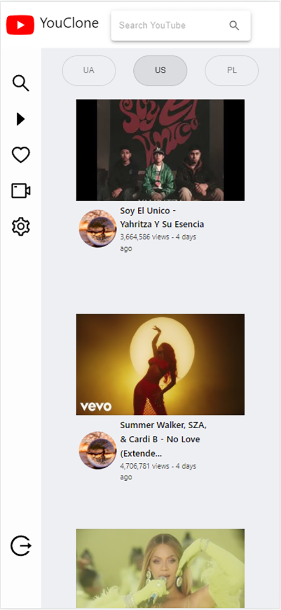

 

 
# YouClone 
 
YouClone is a React TS project that helps you find YouTube vids, watch or download a full video or mp3 version.

Check out the [deployed  site](https://my-youclone.herokuapp.com/).

 

 ## Core packages and Api
    1.React Router - Routing
    2.Styling - Material Ui / @emotion/styled
    3.Network calls - Axios
    4.Api - Youtube Search and Download, YouTube Search Results and others.

 ## Key Features
     1.Search videos
     2.Filters
        - by Country
        - relevance, view, etc..
     3.View all info about the video 
         - ChannelPage with its videos
         - Related Vids
         - Comments
     4.Download items in deferent quality
         - video
         - mp3 
      

## UI
#### Home Page
Web            |  Responsive
:-------------------------:|:-------------------------:
  |  
 #### Single Video Page
 Web            |  Responsive
:-------------------------:|:-------------------------:
  |  
#### Download Page
 Web            |  Responsive
:-------------------------:|:-------------------------:
  |  
#### Single Video Page
   

