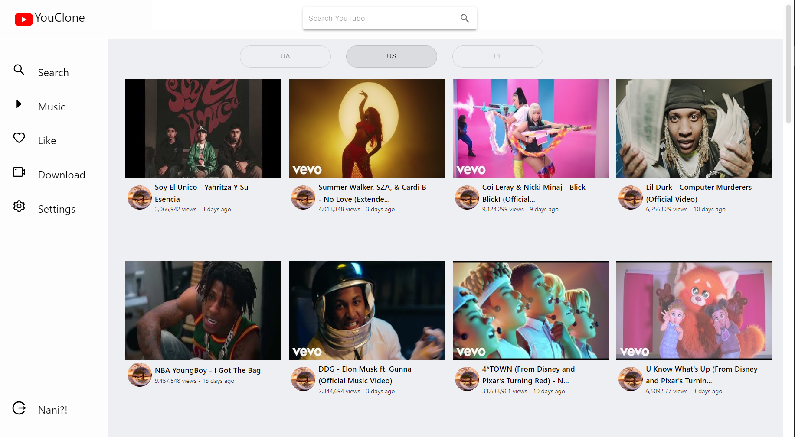
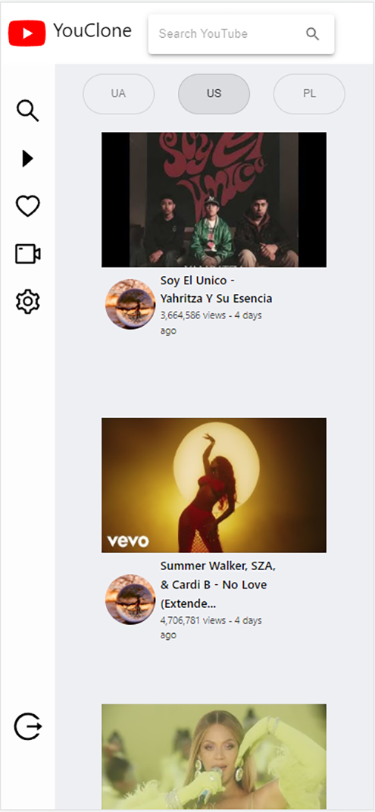
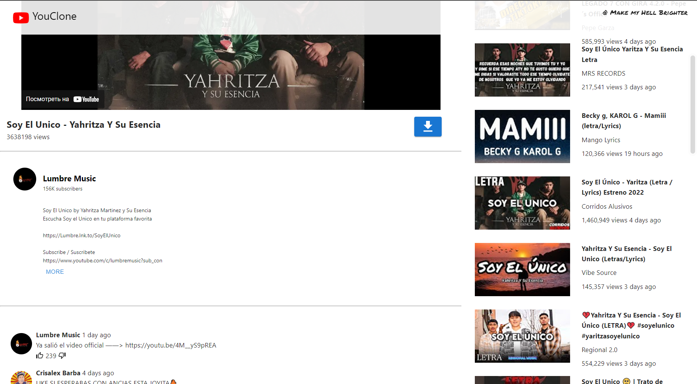
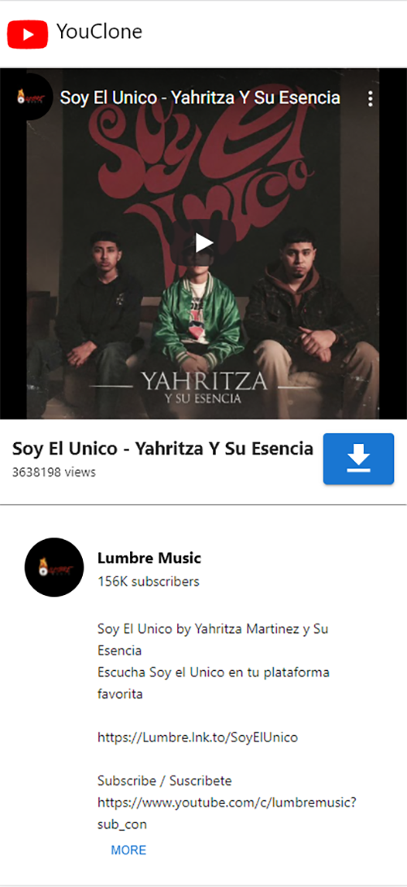
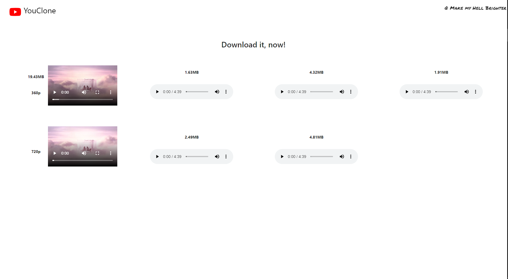
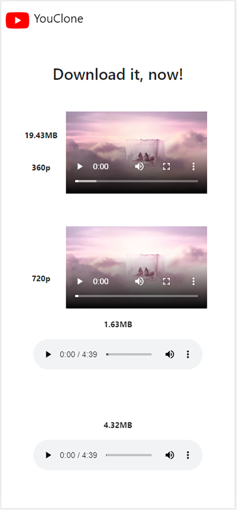
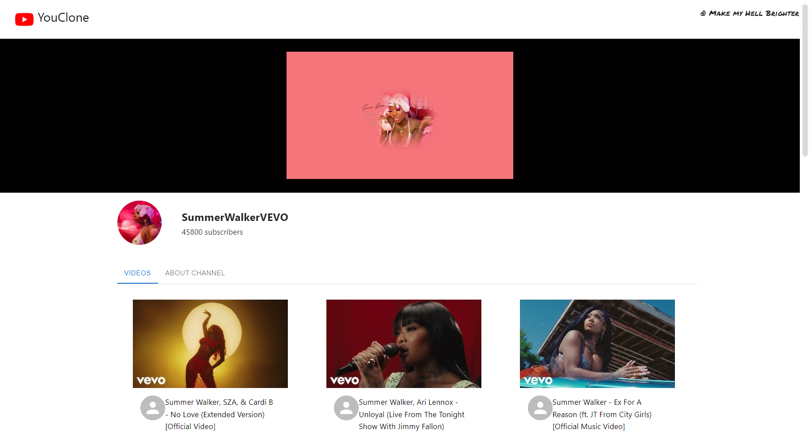

 

 
# YouClone 
 
YouClone is a React TS project that helps you find YouTube vids, watch or download a full video or mp3 version.

 

 ## Core packages and Api
    1.React Router - Routing
    2.Styling - Material Ui / @emotion/styled
    3.Network calls - Axios
    4.Api - Youtube Search and Download, YouTube Search Results and others.

 ## Key Features

##UI
### Home Page
Web            |  Responsive
:-------------------------:|:-------------------------:
  |  

###Single Video Page
 Web            |  Responsive
:-------------------------:|:-------------------------:
  |  
###Download Page
 Web            |  Responsive
:-------------------------:|:-------------------------:
  |  
###Single Video Page
   

